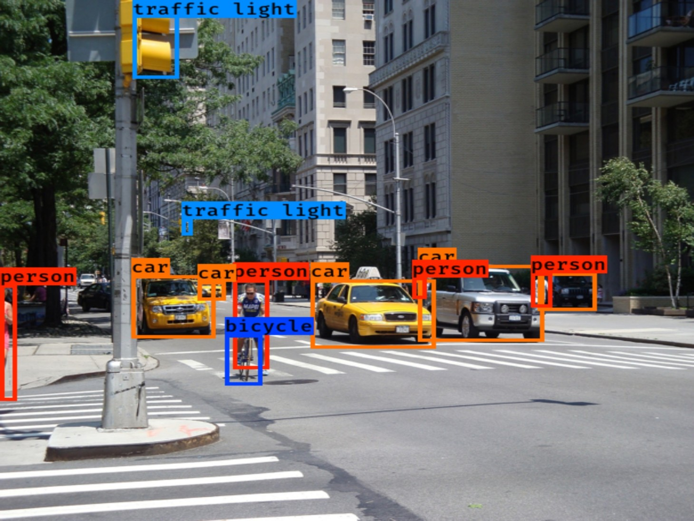

# <!-- TITLE --> __``` OPTICAL CHARACTER RECOGNITION (OCR) & REAL TIME OBJECT DETECTION WITH YOLO ```__
#### <!-- AUTHOR --> - Author : __Dr. Amiehe-Essomba__ (c) 2023


## BUILT WITH 
- __**Python**__ 
- __**Jupyter NoteBook**__ 

> Learn more about  [You Only Look One (YOLO)](https://pjreddie.com/darknet/yolo/) For Object detection 


## PROJECT DESCRIPTION
> Learn about project description [here](https://vision-api.streamlit.app/)

## INTRODUCTION

<p color: black;  
background-color: white; 
font-size: 25px;  
font-weight: bolder;  
text-decoration: underline;  
font-family: Arial, sans-serif;  
text-align: justify;>
In an era marked by technological advancements, the integration of computer vision and artificial intelligence has opened up new avenues for addressing critical societal issues. This project, titled "Enhancing Road Safety through Computer Vision," represents a groundbreaking endeavor in the realm of traffic management and road safety. The primary objective is to harness the power of smart cameras and the YOLO (You Only Look Once) model to prevent traffic accidents and improve road safety.
In a world where road traffic accidents pose a significant threat to human lives and economic stability, the need for innovative solutions is more pressing than ever. This project capitalizes on the potential of computer vision to revolutionize the way we control traffic signals, enabling real-time analysis and decision-making to mitigate risks and enhance the efficiency of road networks.
Through a comprehensive approach encompassing data collection, model training, real-time detection, decision-making, and advanced reporting mechanisms, this project seeks to create an intelligent traffic control system that goes beyond traditional traffic management. By detecting vehicles, pedestrians, and traffic lights in real time and dynamically adapting traffic signal timings, this system aims to prevent accidents, reduce traffic congestion, and contribute to a safer and more efficient road infrastructure.

This project is not only a testament to the power of cutting-edge technology but also a commitment to the safety and well-being of individuals on the road. By leveraging computer vision, it offers a promising solution to one of society's most pressing challenges—road safety enhancement in the face of ever-increasing traffic demands.
</p>

## MODELLING
> Learn about the modelling [here](https://vision-api.streamlit.app/)

## PREDICTION
> Learn about the prediction [here](https://vision-api.streamlit.app/)

### OBJECT DETECTION
</img>

### Segmentic Image Segmentation
</img>

### OCR of Plates & Object Detection
</img>

## CONTRIBUTING
pull requests are welcome. Fore major changes, please open an issue first to discuss what you would like to change.
That's very impotant.

Please make sure to update tests as appropriate.
>For more details read the [contribution guidelines](https://github.com/amiehe-essomba/computer-vision/blob/computer-vision/CONTRIBUTING.md).

## RUNNING PROJECT
This project has been doployed on the [Streamlit Platform](https://vision-api.streamlit.app/). You can run the code directly on Streamlit, and see how the code performs very well. 
In the streatmlit platform th code takes:

> images
> videos 
> links 

You can also use this [notebook](https://github.com/amiehe-essomba/computer-vison-api/blob/vis/main.ipynb) to see how it works.
Enjoy !!!!


## CONCLUSION:
<p color: black;  
background-color: white; 
font-size: 25px;  
font-weight: bolder;  
text-decoration: underline;  
font-family: Arial, sans-serif;  
text-align: justify;>
My computer vision project represents a significant contribution to how we use technology to interact with the world around us, especially in the fields of road traffic and road safety. You have demonstrated how smart cameras and computer vision systems can play a crucial role in monitoring and optimizing road traffic, thereby contributing to traffic flow improvement.

Road safety is a major concern in our societies, and my work has shown how computer vision can be used to detect traffic violations, improve traffic light management and contribute to safer driving environments. My efforts in this area have the potential to save lives especially from road accidents and by increasing safety

Additionally, by helping to ease traffic flow, I have paved the way for more effective traffic management systems, including tackling congestion and improving the efficiency of our transportation networks. My work illustrates the power of smart cameras and computer vision to solve complex and challenging problems, contributing to smarter, more livable cities.


</p>


</img>

## 🤵 Author 
__**Amiehe Essomba**__ 

- [Linkedin](https://www.linkedin.com/in/amiehe-essomba "Amiehe Essomba")
- [Profile](https://github.com/amiehe-essomba "Amiehe Essomba" )
- [Website](https://pypi.org/user/amiehe/ "pypi")
- [Twitter](https://twitter.com/irene_essomba?t=dyzm9cjFPhktK4NEtiqtmw&s=09 "@Essomba" )

## 🤝 Support 
Give a ⭐ if you like this project!

## License 
Copyrihght © 2023 __**Dr. Iréné Amiehe Essomba**__

This project is licensed under [MIT License]()

