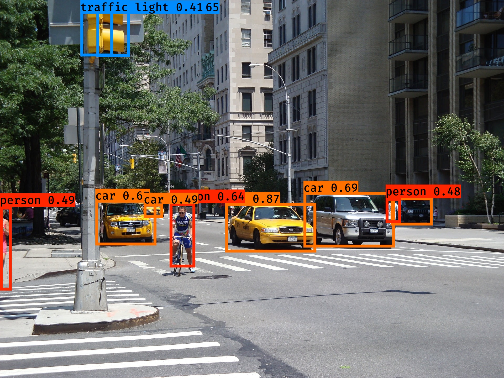

# <!-- TITLE --> __```OBJECT DETECTION WITH YOLO MODEL ```__
#### <!-- AUTHOR --> - Author : __Dr. Amiehe-Essomba__ (c) 2023
</img>


## BUILT WITH 
- __**Python**__ 
- __**Jupyter NoteBook**__ 

> Learn more about  [You Only Look One (YOLO)]() For Object detection 


## PROJECT DESCRIPTION
> Learn more about [Project Description]()

> Example of a code


## CONTRIBUTING
pull requests are welcome. Fore major changes, please open an issue first to discuss what you would like to change.
That's very impotant.

Please make sure to update tests as appropriate.
>For more details read the [contribution guidelines](https://github.com/amiehe-essomba/computer-vision/blob/computer-vision/CONTRIBUTING.md).

## RUNNING PROJECT

## 🤵 Author 
__**Amiehe Essomba**__ 

- [Linkedin](https://www.linkedin.com/in/amiehe-essomba "Amiehe Essomba")
- [Profile](https://github.com/amiehe-essomba "Amiehe Essomba" )
- [Website](https://pypi.org/user/amiehe/ "pypi")
- [Twitter](https://twitter.com/irene_essomba?t=dyzm9cjFPhktK4NEtiqtmw&s=09 "@Essomba" )


## 🤝 Support 
Give a ⭐ if you like this project!

## License 
Copyrihght © 2023 __**Dr. Iréné Amiehe Essomba**__


This project is licensed under [MIT License]()

